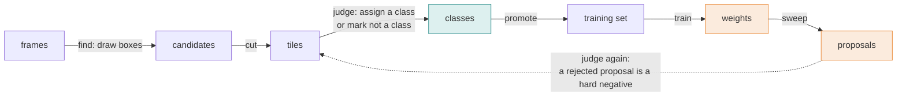

# smolsmort

A small object detector you train by judging its guesses. Draw a few boxes, sort the tiles into
classes, train, and the model proposes boxes on frames nobody has labelled. Those proposals come
back to you to judge, and a wrong one becomes a labelled hard negative rather than being thrown
away. Every round of judging makes the next model better, not just retrained.



Two ways in: a web tool that runs the whole loop (`uv run smolsmort`), and a python library for
the pieces (train, predict, sweep, score, track). The model is swappable: a fixed-size `heatmap`
backend and a variable-size `box` backend are built in, a tabular one sits beside them, and your own
plugs in by name.

The long version - every tab, every file on disk, every route - is
[docs/GUIDE.md](docs/GUIDE.md). A worked setup on one object class is
[docs/WORKED_EXAMPLE.md](docs/WORKED_EXAMPLE.md). The plugin seams and the reasoning behind them are
[docs/REVIEW_TOOL_DESIGN.md](docs/REVIEW_TOOL_DESIGN.md).

## Principles

- **Judging is the product; the model is replaceable.** The loop is four seams with a written
  contract, and a test drives it over fakes. A new model plugs in by name; the loop is not edited.
- **A wrong proposal is a hard negative.** "Not a class" is a label, for swept and drawn boxes
  alike. Unjudged tiles are ignored, never guessed. On a frame marked exhaustive, everything not kept
  is background.
- **Every default has a provenance.** Each number was measured on a real consumer and the code says
  where. Pass your own for a different object.
- **Measure before trusting.** A falling loss means training converged, not that the model is
  right. Only a holdout says that, empty frames included.
- **On-disk conventions are fixed; every extra file is optional.** Old data keeps loading; an
  absent setting means the old behaviour; the loop's files are written whole or not at all.
- **Torch is optional.** The loop, box maths, scoring and tracking need only numpy and pillow.

## Does it fit your problem?

One question picks the backend: **is the object a fixed, known size in pixels?**

- **Yes: `heatmap`.** The model only answers *where* and *which class*. It regresses no width or
  height, which is why it has about 100,000 parameters instead of millions.
- **No: `box`.** It predicts each object's own box, for objects that vary 4x and more in size, in
  frames of different resolutions. About 844,000 parameters. Proven so far on synthetic frames: it
  found 97% of objects standing apart, at a median IoU of 0.74, but only about half of those
  overlapping another.

| your setup | backend |
|---|---|
| A fixed camera or screen capture, objects at one distance or one on-screen size | `heatmap` |
| A top-down camera at a fixed height | `heatmap` |
| Objects at different distances, or classes of very different sizes | `box` |
| Objects that crowd and overlap a lot | `box`, but overlap is its measured weak spot |
| A moving camera | untested with either |
| You need outlines, not positions | neither, you want segmentation |

Quick test: measure your object in twenty frames. If the largest is more than about 1.5 times the
smallest, use `box`.

## Install

Not on PyPI. Pin a release tag from git:

```bash
uv add "smolsmort[vision] @ git+https://github.com/BalthazarFitzpatrick/smolsmort.git@v0.4.0"
```

`[vision]` pulls torch (about 2 GB). Without it you get the box maths, scoring and tracking. The
review tool's page is built on `ui-base`, pulled in as a git dependency. Python 3.11 and newer; CI
runs 3.11 and 3.14 on Linux.

## The review tool

```bash
uv run smolsmort                 # http://127.0.0.1:8080
uv run smolsmort --port 8766 --backend box
```

Four tabs. Data lives under the repo root - `sessions/<recording>/frames/` for frames, `training/`
for everything the loop produces - and the settings popup repoints any of it by browsing.

- **find** - bind a recording, draw boxes on a sample of its frames, mark a frame exhaustive when
  every object on it has been judged. Save cuts each box into a tile with a margin of frame around
  it and writes the boxes as a candidates file.
- **select** - open drawn passes and sweeps into one pool. Tiles arrive clustered; assign a class
  from a definition, or mark a tile "not a class". Assignments are buffered until you save.
  Promote writes the training set.
- **train** - bind a set, pick the backend, see `capture / downscale = input px`, set epochs and
  window (the tab refuses a window that would clip a box), train, watch the loss and the separation
  between object and background, save weights by name. Then sweep a recording and send the
  proposals above a score back to select.
- **housekeeping** - what each recording, live or deleted, still owns downstream, and archive or
  delete it without leaving a pool index pointing at nothing.

Everything on disk is plain files with fixed names and meanings - candidates and decisions,
tiles, a pool index, sets with a small config beside them, checkpoints with two json sidecars.
[docs/GUIDE.md](docs/GUIDE.md) section 9 is the table.

## The library

Train on labelled centres, then find objects on frames the model has not seen. This runs as written
on synthetic frames with a 132x12 bar on noise:

```python
from smolsmort.detect.box import Box
from smolsmort.detect.dataset import Example
from smolsmort.detect.model import decode_peaks
from smolsmort.detect.scoring import boxes_from_peaks, score
from smolsmort.detect.train import heatmaps_for, load, save, train

# one Example per frame: where the objects are, in capture pixels
examples = [Example(path=path, centres=[(cx, cy)]) for path, (cx, cy) in labelled]

model, history = train(examples, epochs=40, batch=8)
save(model, "bars.pt")

model = load("bars.pt")
maps = heatmaps_for(model, "frame.png")  # (classes, h, w), one channel per class
peaks = decode_peaks(maps[0], limit=3)  # centres in capture pixels, strongest first
boxes = boxes_from_peaks(peaks, width=132, height=12)

print("\n".join(score([boxes], [[Box(left, top, 132, 12)]]).lines()))
```

On 20 training frames, 40 epochs on CPU found all 4 held-out bars within 8 px. Two things to know
from that run: weaker secondary peaks around 0.4 appear beside a strong one (`decode_peaks` keeps
anything above `min_score`, 0.35 by default, so raise it or pass `limit`), and `score` reports FAIL
when the truth has no empty frames even at 100% recall, because a false positive can only be
counted on a frame with nothing in it.

**Pixels you already hold.** A live capture does not have to become a file:

```python
from smolsmort.detect.train import frame_input, heatmaps_for_frame, load, predict_frame

model = load(path)  # capture width and downscale come with it
inputs, original_width = frame_input(model, frame)  # frame: (h, w, 3) rgb uint8, frame px
maps, ratio = heatmaps_for_frame(model, frame)  # decode peaks yourself; x, y * ratio -> frame px
found = predict_frame(
    model, frame, classes=classes, width=64, height=14
)  # sweep's dicts minus path
```

`width` and `height` are the box in capture px. A frame narrower or wider than the recorded
capture width is resampled first, and every returned box carries `resampled_from`.

**Swapping the model.** Every backend has four methods - train, predict, save, load - and the loop
drives whichever it is handed:

```python
from smolsmort import backends

backend = backends.get_backend("box")  # or "heatmap", "xgboost"
backends.register("mine", "my_package.backend", "MyBackend")  # yours, no smolsmort edit
```

Listing or picking a backend never imports torch until a vision backend is built. A json sidecar
beside each checkpoint names the backend that wrote it, and a checkpoint without one is a heatmap
checkpoint. `smolsmort.boxes.synthetic` writes frames with known boxes, for proving a setup before
any real data is labelled.

**Adding a tab.** A host page loads a script after `boot.js` that calls:

```js
window.smolsmortTabs.register({
  id: 'mytab',          // unique, used as the panel's data-panel
  label: 'my tab',      // shown in the tab bar
  mount(panelEl) {      // runs once; fill panelEl with your markup
    panelEl.textContent = 'hello';
    return {enter() {}};  // optional: called each time the tab is shown
  },
});
```

Its routes come in as a `smolsmort.review.routes.Tab` (`get`, `post`, `images` tables) passed to
`build_app(tabs=[...])`; a path that collides with a core route is refused when the server is
built, and `GET /api/tabs` lists what is registered.

## How it works

**The model.** A fully convolutional net with one heatmap channel per class. It runs on the frame
downscaled (2 by default; the factor is stored in the checkpoint), with a stride of 4 on top, so one
heatmap cell covers 8x8 capture pixels at the default. A wide 3x9 kernel near the end helps it see
across long, thin objects. Parameters: 99,769 with one class, 100,210 with ten. Fully convolutional
means it trains on small crops and runs on whole frames of any size.

**Peaks, not boxes.** `decode_peaks` finds local maxima above a threshold, suppresses neighbours
within 3 cells, and returns centres in capture pixels. Since the object size is known, the box
follows from the centre. The channel a peak comes from is its class.

**The box backend.** The same heatmap idea plus two more outputs per cell: the object's log width
and height, and where its centre sits inside the cell. An encoder down to stride 32 gives each cell a
view of about 440 px, enough to size the largest object it is trained on, and training refuses an
object bigger than that rather than sizing it wrong. Every frame is scaled to one working long side
(768 px) first, which is why frames of different resolutions can train together.

**Training.** Each batch is cut into 256 px windows. Half the windows land around a real object,
offset up to 40% of the window so the model learns objects anywhere, not just near the middle. A
quarter land around hard negatives when a frame has them, the rest anywhere. Both backends share
that policy (`smolsmort.detect.windows`). Targets are small Gaussian blobs snapped to cell centres,
trained with a CentreNet-style focal loss; channels train independently, so a rare class is not
drowned out by a common one.

**Capture size.** The heatmap model records the frame width it was trained at and its downscale.
Training reads the width off the frames unless told otherwise; a frame of another width is
resampled to it before the downscale, at training and at inference, and decoded boxes are mapped
back to the frame's own pixels. Fine-tuning at a different downscale is refused; the architecture
depends on it. A `heatmap` set must use one capture resolution and mixing is refused; `box` scales
every frame to one working size instead.

**Sweeping.** `sweep` runs trained weights over whole frames and returns candidates in the schema
the judging step reads, capped per frame and strongest first. Frames decode on worker threads ahead
of the model: at 3420x2224, decoding a JPEG took 51 ms against 39 ms for the forward pass.

**Scoring.** Matching is per frame and positional: two boxes match when they cover the same span on
the same row. IoU fails on thin objects (an 8 px vertical offset on a 132x12 bar drops IoU to 0.12);
pass `match=iou_match(0.5)` for squarer or variable-size objects. The built-in pass marks are 90%
recall with at most 5% false-positive frames; `beats_the_teacher` compares against the 75% recall,
75% precision classical detector the model was built to beat.

**Tracking.** `track` follows one object across a recording: the strongest peak with no history,
then the strongest within a plausible step (not the nearest, so it does not chase decoys).
`despike` drops frames that disagree with their neighbours' median; `chrome_cells` finds detections
that never move while the camera turns - interface, not world.

## Defaults and where they came from

Every tuned number was measured on the first consumer, a screen-capture detector for long, thin
objects about 132x12 px on a 2560-wide capture. They are parameters with a stated origin; pass your
own for a different object.

| setting | default | where it lives |
|---|---|---|
| same object across frames | 40 px corner distance | `box.SAME_OBJECT_PX` |
| same object within a frame | half the narrower width shared, within 1.5 box heights | `box.SAME_OBJECT_MIN_SHARE`, `SAME_OBJECT_MAX_ROWS_APART` |
| input downscale / heatmap stride | 2 / 4 | `model.DEFAULT_DOWNSCALE` (a model stores its own), `model.STRIDE` |
| peak threshold / separation | 0.35 / 3 cells | `model.PEAK_MIN_SCORE`, `PEAK_MIN_SEPARATION` |
| training window / offset | 256 px / 40% | `train.CROP`, `train.JITTER_FRACTION` |
| tracker step / lost after | 600 px / 5 frames | `track.MAX_STEP_PX`, `LOST_AFTER_FRAMES` |
| box backend working long side | 768 px, from a synthetic spike | `boxes.model.WORK_LONG_SIDE` |
| review tile | 64x14 px, plus a crop margin | `review.state.DEFAULT_TILE_SIZE`, `paths.MARGIN_X/Y` |

`train.minimum_window(width, height)` is the smallest window that never clips your object at the
offset extremes; `train.snapped_window` rounds a window up to a whole number of cells.

## In use

The first consumer runs it live on screen captures: 10 classes, 100,210 parameters, about 44 ms
per 3420x2224 frame on an Apple M4 including the JPEG decode. Its first honest evaluation on a
hand-drawn holdout returned 24% precision, with the highest-scoring detections the wrong ones. That
is what the loop exists to find out.

## Development

```bash
uv sync --extra vision
uv run ruff check . --fix --extend-exclude .claude && uv run ruff format --extend-exclude .claude .
uv run pytest -q
uv run --with playwright pytest tests/test_review_ui_browser.py -q   # headless chromium, one test per tab
```

CI runs the suite on 3.11 and 3.14 and the browser check on 3.14. Work on this repo runs as
[smortboard](https://github.com/BalthazarFitzpatrick/smortboard) cards; a card may only write the
files its lease allows, and one that stops on `LEASE_CONFLICT` names the files it needed - widen
the lease and resume it (the procedure is in smortboard's troubleshooting).

## Licence

MIT, see [LICENSE](LICENSE).
