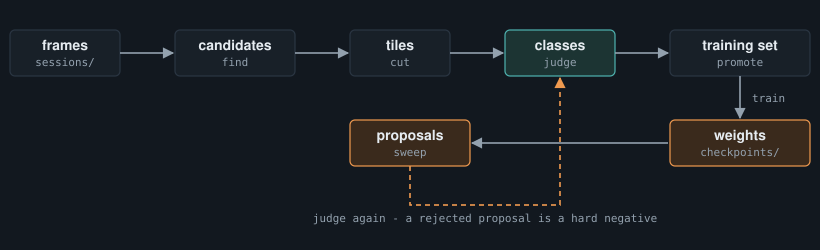

# smolsmort

**A small object detector you train by judging its guesses.** Draw boxes on a few frames, sort the
cut-out tiles into classes, train. The model then proposes boxes on frames nobody has labelled, and
those proposals come back to you to judge. A wrong one becomes a labelled hard negative rather than
being thrown away, and that is what makes the next model better instead of merely retrained.

<picture>
  <source media="(prefers-color-scheme: light)" srcset="docs/images/art-loop-light.svg">
  
</picture>


<sub>Every screenshot on this page is the test suite's synthetic world: generated frames, invented classes.</sub>

> **Early.** One consumer runs it daily; the loop, the files it writes and the two vision backends
> are exercised on real data. The box backend is proven on synthetic frames only, and every default
> was measured on one object. See [What is solid, what is not](#what-is-solid-what-is-not).

**Contents** ·
[Install & start](#install--start) ·
[Concepts](#concepts) ·
[How to use it well](#how-to-use-it-well) ·
[The library](#the-library) ·
[Reference](#reference) ·
[Troubleshooting](#troubleshooting) ·
[Development](#development)

---

## Install & start

Two commands, then look before you label anything real:

```bash
uv add "smolsmort[vision] @ git+https://github.com/BalthazarFitzpatrick/smolsmort.git@v0.4.1"
uv run smolsmort
```

That prints `http://127.0.0.1:8080` - the review tool, four tabs, empty until it has frames. Put a
recording under `sessions/<name>/frames/` (any folder of images), bind it from the find tab, draw a
few boxes and save: you now have tiles to judge, and the rest of the page comes alive.

`[vision]` pulls torch (about 2 GB). Without it you get the loop's file handling, the box maths,
scoring and tracking, and no model. The page is built on [smortui](https://github.com/BalthazarFitzpatrick/smortui),
pulled in as a git dependency. Python 3.11 and newer; CI runs 3.11 and 3.14 on Linux.

**Decide first whether it fits.** One question picks the backend: *is the object a fixed, known
size in pixels?* Yes means `heatmap`, about 100,000 parameters, answering only where and which
class. No means `box`, about 844,000, predicting each object's own size. Measure the object in
twenty frames; if the largest is more than 1.5x the smallest, it is `box`. A moving camera is
untested with either, and outlines rather than positions want segmentation, not this.

The long version - every tab, every file, every route - is [docs/GUIDE.md](docs/GUIDE.md). A worked
setup on one object class is [docs/WORKED_EXAMPLE.md](docs/WORKED_EXAMPLE.md).

---

## Concepts

Eight things worth understanding. Each has a rule that surprises people; the rule is stated with it.

### Candidates

A candidate is one box on one frame, whoever put it there: a human drawing in the find tab, or the
model sweeping a recording. Both write the same file shape - `path, left, top, width, height,
score` - into `training/boxes/<recording>.<drawn|cnn>-<stamp>.candidates.jsonl`, and both are judged
by the same tab.

**The surprising part: a candidates file is never rewritten under its name.** Judgements are keyed
to it by index in a `.decisions.json` beside it, so rewriting a candidates file would re-point every
recorded keep at a different box. A re-sweep is a new file.

### Tiles and the pool

Saving in the find tab cuts each box into a tile: the box plus a margin of real frame around it, so
there is something to lock onto when judging. Tiles from any number of drawn passes and sweeps can
be open in one pool at once, and the pool's index (`_labels.json`) carries each tile's judgement.

### Judging

In the select tab you assign a class to a tile or a group, or you mark it **not a class**.
Assignments are buffered and written when you press save; closing with unsaved changes asks.

**The surprising part: "not a class" is a label, not a deletion.** A rejected tile trains as a
negative - a place the model (or a person) said "object" and was told no. Swept and drawn boxes are
treated alike. A tile nobody judged is ignored by the loss, never guessed at.

### Exhaustive frames

A frame is explicit by default: only the judged boxes on it mean anything, because it may hold
objects nobody drew. Mark a frame **exhaustive** in the find tab when every object on it has been
proposed or drawn and judged. On such a frame, at promotion, anything not kept becomes background -
except a box centred inside a kept one, which is a misaligned duplicate rather than an absence.

### Training sets and their config

Promote turns the judged pool into `training/sets/<name>.jsonl`: one row per box, positives with
their class, negatives from the rejections and from exhaustive frames. A small `_backend.json`
beside it holds the set's backend, its box-size mode, and optionally a capture width and downscale.

**The surprising part: every setting file is optional, and absent means the old behaviour.** A set
without `_backend.json` is heatmap with one uniform box size; a recording without `_frames.json` is
all explicit. Old data opens unchanged in a new version.

### Backends and capture size

A backend is a class with four methods - train, predict, save, load - registered by name. The loop
drives whichever it is handed and never learns which. Three ship: `heatmap`, `box`, and `xgboost`
for rows of features instead of frames.

**The surprising part: a heatmap checkpoint records the frame width it was trained at.** A frame of
another width is resampled to it, run at the weights' own downscale, and the boxes come back in the
frame's own pixels. A `heatmap` set must use one capture resolution - mixing is refused, since the
object is a different pixel size on each - while `box` scales every frame to one working size.

### Sweep, and where the loop closes

A sweep runs the weights over a recording and writes what it finds as candidates, capped per frame
and strongest first, at a floor well below the score you will keep. **Send above threshold** cuts
the proposals above the slider into the pool, and they arrive beside the drawn tiles, to be judged
the same way. The train tab's separation readout - the model's response on a confirmed object
against background - is the number to choose that threshold against.

**The surprising part: the model can be changed under a sweep, so the tool refuses.** Binding a set,
loading weights, switching the backend or starting a run are refused while a sweep or a run is
going; the worker reads the model as it goes, and a swap mid-recording would mix two models into one
file.

### Checkpoints and their sidecars

Saving weights writes `<name>.pt` plus two json files beside it: the backend's sidecar (`.pt.json`:
backend, classes, box size, capture width, downscale) and the review-level provenance
(`.pt.provenance.json`: the training set, the options the run used, when). The provenance is written
before the weights, so a listing never sees a checkpoint without it. A typed name that is already
taken is refused; a suggested name gets numbered.

### Housekeeping

Recordings get deleted by hand from `sessions/`, and nothing downstream knows. The housekeeping tab
lists every recording, live or gone, with the boxes, tiles, sets and checkpoints it owns, and
archives them (moved to `_archive/`, recoverable) or deletes them - updating the pool index in the
same operation, so it never points at a tile that is gone.


---

## How to use it well

The tool is built on one assumption: **the judging is the work, and the model is the cheap part.**
Everything that rewards trusting a number is a design mistake in it.

### The loop you actually run

1. **Draw a few dozen boxes**, not hundreds. Fifty labelled frames is a real start; the loop is how
   it grows. Mark a frame exhaustive only when you have really judged everything on it.
2. **Judge and promote.** Assign classes, mark the wrong tiles not a class, save, promote.
3. **Train**, with the window at or above the floor the tab shows. A window that would clip a box
   is refused, because it would teach half an object as a whole one.
4. **Sweep a recording the model has not seen**, with the min score low. Look at the separation
   readout and the score distribution before choosing a threshold; a floor above what the model
   produces returns nothing and looks like success.
5. **Send the proposals to select and judge them.** The wrong ones are the valuable ones.
6. Promote, train, sweep. Repeat.

### When to trust a number

**Never read a falling loss as "the model is right."** It means training converged. The first
consumer's detector reported a healthy internal score and returned 24% precision on a hand-drawn
holdout, with the highest-scoring detections the wrong ones. Only a holdout the model never
influenced says whether it is right - and it needs empty frames in it, because an empty frame is the
only place a false positive can be counted cleanly.

**Every default has a provenance, and it is not yours.** The peak threshold, the window jitter, the
tracker's step: each was measured on one consumer (long, thin objects about 132x12 px on a
2560-wide capture) and the code says where. They are parameters. Pass your own.

### The mistakes that cost a day

- **A partly-labelled frame marked exhaustive.** Every unmarked object on it becomes a negative, and
  the model learns that objects are background.
- **A `min_score` above the model's range.** Zero proposals, no error, looks like a clean sweep.
- **A holdout derived from the model's own output.** It measures agreement, not accuracy.
- **Mixing capture resolutions in a heatmap set.** It is refused, but a holdout at another scale is
  not - and it measures the mismatch, not the model.
- **Objects at varying distance on the heatmap backend.** The failure looks like a model that never
  quite converges, not like a wrong tool. Use `box`.
- **Adding a class with three examples.** Its channel fires on noise, and it will look like the
  model working.

---

## The library

Train on labelled centres, then find objects on frames the model has not seen. This runs as written
on synthetic frames with a 132x12 bar on noise:

```python
from smolsmort.detect.box import Box
from smolsmort.detect.dataset import Example
from smolsmort.detect.model import decode_peaks
from smolsmort.detect.scoring import boxes_from_peaks, score
from smolsmort.detect.train import heatmaps_for, load, save, train

# one Example per frame: where the objects are, in capture pixels
examples = [Example(path=path, centres=[(cx, cy)]) for path, (cx, cy) in labelled]

model, history = train(examples, epochs=40, batch=8)
save(model, "bars.pt")

model = load("bars.pt")
maps = heatmaps_for(model, "frame.png")  # (classes, h, w), one channel per class
peaks = decode_peaks(maps[0], limit=3)  # centres in capture pixels, strongest first
boxes = boxes_from_peaks(peaks, width=132, height=12)

print("\n".join(score([boxes], [[Box(left, top, 132, 12)]]).lines()))
```

On 20 training frames, 40 epochs on CPU found all 4 held-out bars within 8 px.

**Pixels you already hold** - a live capture - need no file. Three entry points walk the same steps a
sweep walks per frame, so the two cannot drift:

```python
from smolsmort.detect.train import frame_input, heatmaps_for_frame, load, predict_frame

model = load(path)  # capture width and downscale come with it
inputs, original_width = frame_input(model, frame)  # frame: (h, w, 3) rgb uint8, frame px
maps, ratio = heatmaps_for_frame(model, frame)  # decode peaks yourself; x, y * ratio -> frame px
found = predict_frame(
    model, frame, classes=classes, width=64, height=14
)  # sweep's dicts minus path
```

**Swapping the model.** Every backend has the same four methods, and listing or picking one never
imports torch until a vision backend is built:

```python
from smolsmort import backends

backend = backends.get_backend("box")  # or "heatmap", "xgboost"
backends.register("mine", "my_package.backend", "MyBackend")  # yours, no smolsmort edit
```

**Adding a tab to the page.** A host script loaded after `boot.js` registers one; its routes come in
as a `smolsmort.review.routes.Tab` passed to `build_app(tabs=[...])`, and a path that collides with
a core route is refused when the server is built:

```js
window.smolsmortTabs.register({
  id: 'mytab',          // unique, used as the panel's data-panel
  label: 'my tab',      // shown in the tab bar
  mount(panelEl) {      // runs once; fill panelEl with your markup
    panelEl.textContent = 'hello';
    return {enter() {}};  // optional: called each time the tab is shown
  },
});
```

---

## Reference

### Command

```bash
uv run smolsmort                 # http://127.0.0.1:8080
uv run smolsmort --port 8766 --backend box
```

### Folders

Everything lives under the repo root unless the settings popup repoints it; the choice is
remembered in `training/review_bases.json`.

| base | default | holds |
|---|---|---|
| sessions | `sessions/` | recordings: `<name>/frames/` of images |
| labels | `training/boxes/` | candidates files, their decisions, per-recording frame modes |
| pool | `training/tiles/` | cut tiles and the pool index; may be several folders |
| sets | `training/sets/` | promoted training sets and their config |
| weights | `training/weights/checkpoints/` | checkpoints and their two sidecars |
| classes | `training/classes/` | class definitions |

### How the model works

**Heatmap.** A fully convolutional net with one channel per class, run on the frame at `downscale`
(2 by default, stored in the checkpoint) with a stride of 4 on top, so a cell covers 8x8 capture
pixels at the default. A wide 3x9 kernel near the end helps it see across long, thin objects.
99,769 parameters with one class, 100,210 with ten. Peaks above a threshold are centres; the box
follows from the centre because the size is known; the channel a peak comes from is its class.

**Box.** The same heatmap plus, per cell, the object's log width and height and where its centre
sits inside the cell. An encoder down to stride 32 gives each cell a view of about 440 px, enough to
size the largest object it is trained on; training refuses an object bigger than that rather than
sizing it wrong. Every frame is scaled to one working long side (768 px) first.

**Training.** Batches are cut into 256 px windows. Half land around a real object, offset by up to
40% of the window so the model learns objects anywhere, not near the middle. A quarter land around
hard negatives, the rest anywhere. Both backends share that policy. Targets are small Gaussian blobs
snapped to cell centres, trained with a CentreNet-style focal loss; channels train independently, so
a rare class is not drowned by a common one.

**Sweeping.** Frames decode on worker threads ahead of the model: at 3420x2224, decoding a JPEG took
51 ms against 39 ms for the forward pass. The first consumer runs it live at about 44 ms per frame
on an Apple M4, decode included, with ten classes.

**Scoring.** Per frame and positional: two boxes match when they cover the same span on the same
row, because IoU fails on thin objects (an 8 px vertical offset on a 132x12 bar drops it to 0.12).
Pass `match=iou_match(0.5)` for squarer ones. The built-in pass marks are 90% recall with at most 5%
false-positive frames.

**Tracking.** `track` follows one object across a recording: the strongest peak with no history,
then the strongest within a plausible step rather than the nearest, so it does not chase decoys.
`despike` drops frames that disagree with their neighbours' median.

### Defaults and where they came from

| setting | default | where it lives |
|---|---|---|
| same object across frames | 40 px corner distance | `box.SAME_OBJECT_PX` |
| same object within a frame | half the narrower width shared, within 1.5 box heights | `box.SAME_OBJECT_MIN_SHARE`, `SAME_OBJECT_MAX_ROWS_APART` |
| input downscale / heatmap stride | 2 / 4 | `model.DEFAULT_DOWNSCALE` (a model stores its own), `model.STRIDE` |
| peak threshold / separation | 0.35 / 3 cells | `model.PEAK_MIN_SCORE`, `PEAK_MIN_SEPARATION` |
| training window / offset | 256 px / 40% | `train.CROP`, `train.JITTER_FRACTION` |
| tracker step / lost after | 600 px / 5 frames | `track.MAX_STEP_PX`, `LOST_AFTER_FRAMES` |
| box backend working long side | 768 px, from a synthetic spike | `boxes.model.WORK_LONG_SIDE` |
| review tile | 64x14 px, plus a crop margin | `review.state.DEFAULT_TILE_SIZE`, `paths.MARGIN_X/Y` |

`train.minimum_window(width, height)` is the smallest window that never clips your object at the
offset extremes; the train tab shows it as the floor.

### Routes

The page speaks a small json api under `/api/`; an error is `{"error": "..."}` with a 4xx status.
The full table, by tab, is in [docs/GUIDE.md](docs/GUIDE.md#12-routes).

### What is solid, what is not

**Solid.** The loop end to end - draw, cut, judge, promote, train, sweep, judge again - on real
recordings, daily. The heatmap backend and its capture-size handling. The files it writes and their
backward compatibility. The test suite: the whole loop over fake backends, every route, and the
page in headless chromium, one test per tab, on every pull request.

**Rough.**

- **The box backend is proven on synthetic frames only:** 97% of objects standing apart found at a
  median IoU of 0.74, about half of those overlapping another.
- **Every default was measured on one object** - long, thin, on a screen capture. Another object
  wants its own numbers.
- **The train tab has no continue-from-weights control**; fine-tuning exists in the library, and a
  different downscale is refused.
- **Heatmap overlays stay in the resampled input space**; only sweep decoding maps back to the
  frame.
- **The tabular backend is a mechanics check.** The seam holds; the real data has not arrived.

---

## Troubleshooting

| Symptom | What it means |
|---|---|
| `nothing bound to train on` | bind a promoted set from the train tab's **tiles** picker first |
| `windows N is below the M floor` | the training window would clip a box; raise it to the floor the tab shows |
| `a sweep is running` / `a training run is going` | wait for it; the worker reads the model as it goes |
| `<name> already exists - pick another name` | a typed checkpoint name is taken; an unnamed save is numbered instead |
| `mixed resolutions` when binding a heatmap set | the set's frames differ in width; one capture per heatmap set, or use `box` |
| the sweep shows a resample warning | frames are not the weights' capture width; they were resampled and the boxes mapped back, nothing to fix |
| a sweep found nothing | the min score is above the model's range - look at the separation readout and lower it |
| the page's dropdowns are empty | the folders in settings do not exist yet; the settings popup browses for them |

---

## Development

```bash
uv sync --extra vision
uv run ruff check . --fix --extend-exclude .claude && uv run ruff format --extend-exclude .claude .
uv run pytest -q
uv run --with playwright pytest tests/test_review_ui_browser.py -q   # headless chromium, one test per tab
uv run --with playwright python tests/browser_check.py shots/         # the same, with a screenshot per tab
```

CI runs the suite on 3.11 and 3.14 and the browser check on 3.14. `--extend-exclude .claude` keeps
ruff out of any card worktrees. The suite's `conftest.py` sets openmp variables on macOS only, where
torch's and xgboost's runtimes clash. Work on this repo runs as
[smortboard](https://github.com/BalthazarFitzpatrick/smortboard) cards; a card may only write the
files its lease allows.

`docs/GUIDE.md` is the user guide, `docs/WORKED_EXAMPLE.md` a setup on one class,
`docs/REVIEW_TOOL_DESIGN.md` the four plugin seams and why they are cut where they are.

## License

[MIT](LICENSE). Use it, change it, ship it; keep the copyright notice.
