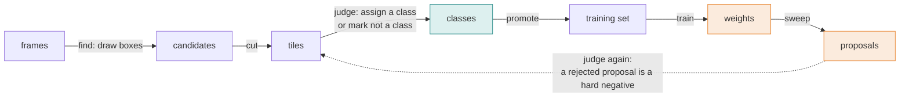
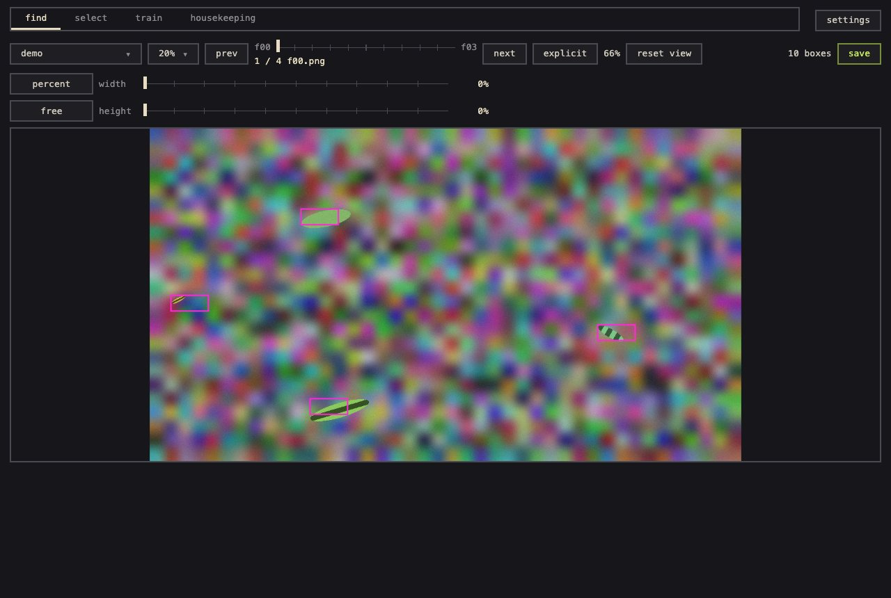
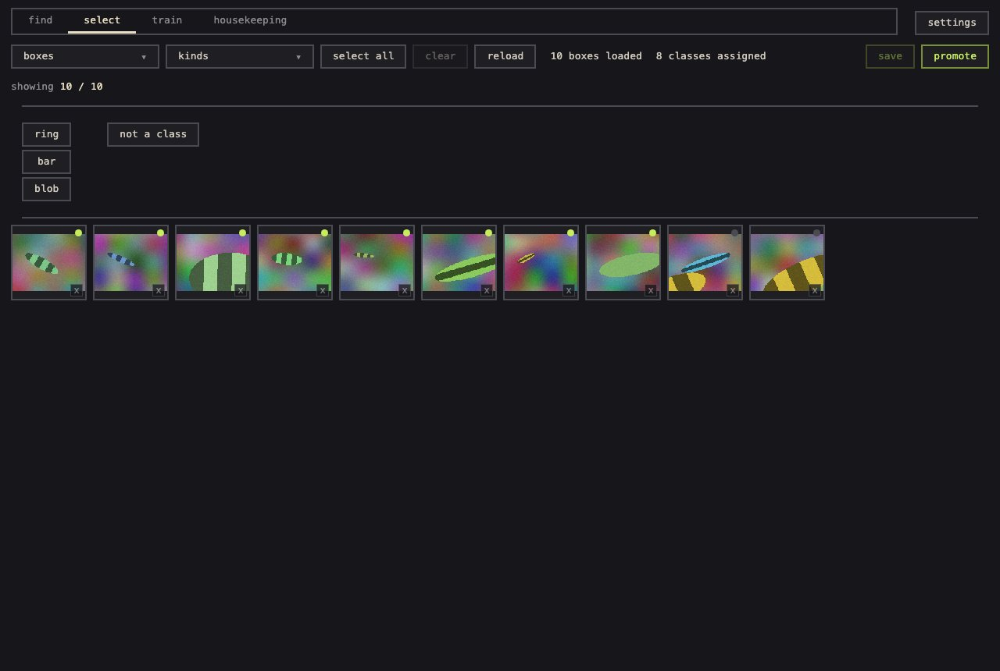
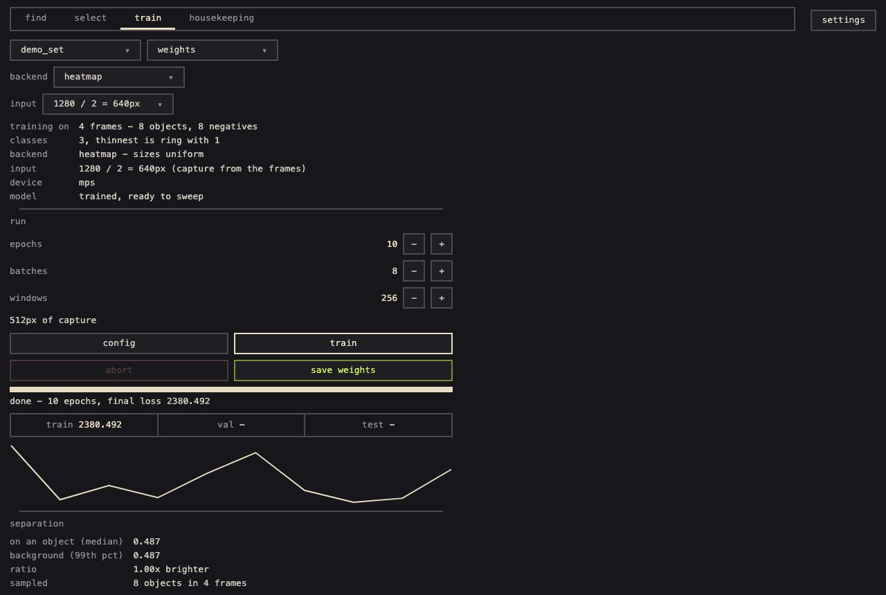
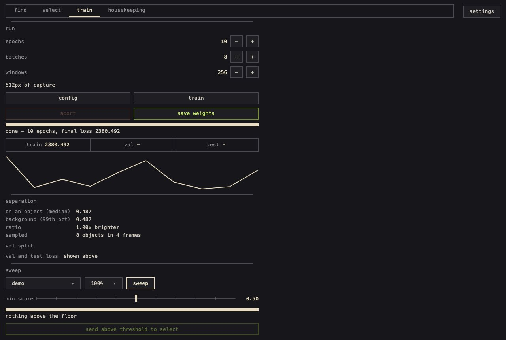
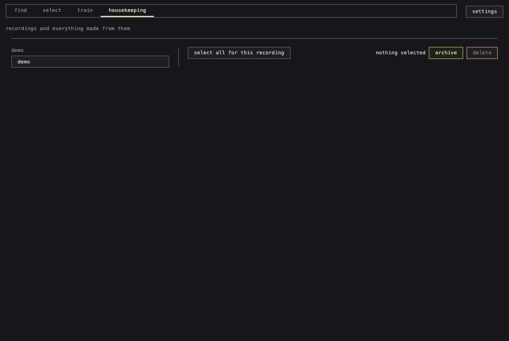
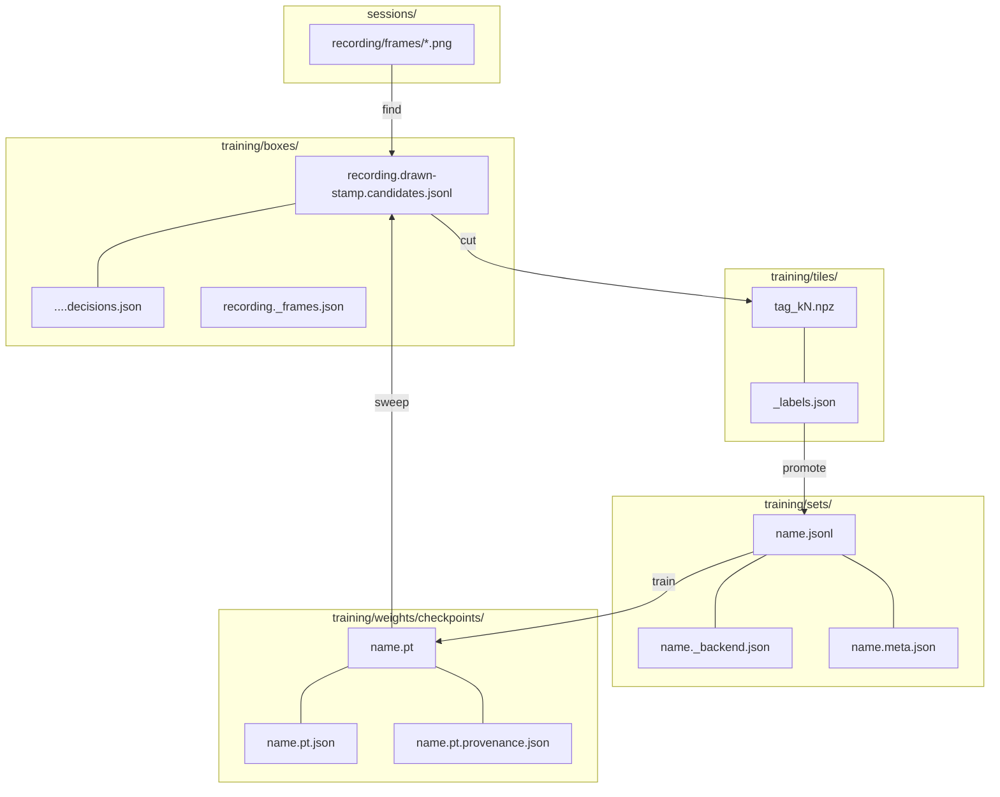

# smolsmort user guide

**Everything the README leaves out.** What smolsmort does and does not do, the principles it is
built on, each tab control by control, every file it writes and the shape of each, every route, and
how to extend it. Every path, route and number here exists in the code at the version this guide
ships with; where something is a known limit it says so.

Shorter reads: the [README](../README.md) for the pitch, the concepts and the library;
[WORKED_EXAMPLE.md](WORKED_EXAMPLE.md) for a setup on one object class;
[REVIEW_TOOL_DESIGN.md](REVIEW_TOOL_DESIGN.md) for the four plugin seams and why they are cut
where they are.

**Contents** ·
[What it is](#1-what-it-is) ·
[Principles](#2-principles) ·
[The loop](#3-the-loop-stage-by-stage) ·
[Running the tool](#4-running-the-review-tool) ·
[Find](#5-the-find-tab) ·
[Select](#6-the-select-tab) ·
[Train](#7-the-train-tab) ·
[Housekeeping](#8-the-housekeeping-tab) ·
[On disk](#9-what-lands-on-disk) ·
[Backends](#10-backends) ·
[Library](#11-using-the-library-directly) ·
[Routes](#12-routes) ·
[Extending](#13-extending) ·
[Development](#14-development) ·
[Limits](#15-known-limits)

---

## 1. What it is

smolsmort is a small object detector plus the loop that trains it by judging. You draw a few boxes
on frames, the tool cuts them into tiles, you sort the tiles into classes, a model trains on the
result, the model proposes boxes on frames nobody has drawn on, and those proposals come back to
you to judge. A proposal you reject is not thrown away: it becomes a labelled hard negative, and
that is what makes the next model better rather than merely retrained.



Three model backends drive the same loop and never learn which one they are:

| backend | for | size |
|---|---|---|
| `heatmap` | objects of one known pixel size on a fixed camera or screen capture | ~100k parameters |
| `box` | objects that vary 4x and more in size, frames of different resolutions | ~844k parameters |
| `xgboost` | rows of features instead of frames (a forecast task; the seam holds, real data is still to come) | - |

What it is not: a segmentation tool (no outlines), a general-purpose detector you download weights
for (you train it on your own frames, from a few dozen boxes up), or a tracker for many objects
(`track` follows one).

## 2. Principles

These are the rules the code is written to, and the ones a change is judged against.

**Judging is the product; the model is replaceable.** The four things the loop needs - where
candidates come from, how one is shown to a human, what a class is, and a model that trains and
predicts - are seams with a written contract, and a test drives the whole loop over fakes for each
of them. A new model, renderer or class scheme plugs in by name; the loop is never edited for it.

**A wrong proposal is a hard negative.** Discarding a tile, or marking it "not a class", is a
label, for swept and drawn boxes alike. Tiles nobody judged are ignored by the loss, never guessed.
On a frame marked exhaustive, everything proposed and not kept is background.

**Every default has a provenance.** Each tuned number - the peak threshold, the window jitter, the
tracker's step - was measured on a real consumer, and the code says where. A number without a
stated origin is a magic number and gets a comment or an argument before it stays.

**Measure before trusting.** A falling loss means training converged, not that the model is right.
Only a holdout says that. Scores are computed per frame, empty frames included, because that is the
only place a false positive can be counted cleanly.

**On-disk conventions are fixed, and every extra file is optional.** The stage files (section 9)
are the contract between stages and between versions. A file written by an older version still
loads; a setting file that is absent means the old behaviour. Nothing is rewritten in place under
a name something else keys on.

**Fail loud on provenance, atomic on the loop's files.** A set that mixes capture resolutions is
refused rather than silently averaged; a malformed row is skipped and counted, never guessed. The
files the loop depends on are written whole or not at all.

**Torch is optional.** The loop, the box maths, scoring and tracking need only numpy and pillow.
Only a vision backend imports torch, and only when it is built.

## 3. The loop, stage by stage

1. **Find.** Bind a recording (a folder of frames), draw boxes on some frames. Saving cuts each box
   into a tile with a margin of real frame around it, and writes the boxes as a candidates file.
2. **Judge (select).** Open one or more tile sources into a pool. Tiles cluster into groups; you
   assign a class to a group or a tile, or mark it "not a class". Assignments are buffered and
   written when you press save.
3. **Promote.** Turn the judged tiles into a training set: one row per box, positives with their
   class, negatives from "not a class" verdicts, plus negatives for everything unjudged on
   exhaustive frames.
4. **Train.** Bind a set, pick the backend, set epochs/batches/window, train. Losses on train, val
   and test splits; a separation readout (response on an object vs background). Save the weights
   under a name.
5. **Sweep.** Run the weights over a recording. Every frame's peaks above the floor become
   candidates in the same schema as drawn boxes, capped per frame, strongest first.
6. **Judge again.** Send the proposals above a score into the pool. They arrive as tiles beside the
   drawn ones, and the loop closes.

## 4. Running the review tool

```bash
uv run smolsmort                # http://127.0.0.1:8080
uv run smolsmort --port 8766 --backend box
```

The page has four tabs - find, select, train, housekeeping - and a settings popup (top right).

**Folders.** Everything lives under the repo root unless you repoint it in settings:

| base | default | holds |
|---|---|---|
| sessions | `sessions/` | recordings: one folder per recording with a `frames/` folder of images |
| labels | `training/boxes/` | candidates files and their decisions |
| pool | `training/tiles/` | cut tiles and the pool index; may be several folders |
| templates | `training/library/` | a template library, for an example source that matches against one |
| sets | `training/sets/` | promoted training sets |
| weights | `training/weights/checkpoints/` | saved weights and their sidecars |
| classes | `training/classes/` | class definitions |

The settings popup browses folders rather than taking typed paths, and remembers choices in
`training/review_bases.json`; the find tab's crop rule persists in `training/review_crop.json`.

## 5. The find tab



- **recordings** opens a picker over the sessions folder; binding one loads its frames. A percent
  control decides how many of the frames you draw on (evenly spaced), so a long recording is
  labelled on a sample.
- **draw**: drag a rectangle on the frame; click inside a box to remove it. Arrow buttons and a
  slider move between frames; the zoom fits the frame to the panel.
- **crop rule**: the tile a box becomes is the box plus ground around it, as a percent of the box
  or as absolute pixels, with a fixed or free aspect. It applies to every box cut in this pass and is
  remembered.
- **exhaustive**: a per-frame toggle. On an exhaustive frame every object was proposed or drawn and
  judged, so at promotion anything not kept is background. Default is explicit (only judged boxes
  mean anything). Stored per recording in `<recording>._frames.json`.
- **save** writes `<recording>.drawn-<stamp>.candidates.jsonl` in the labels folder and cuts one
  tile per box into the pool under a tag `<recording>_drawn-<stamp>`.

## 6. The select tab



- **boxes** opens sources into the pool: a drawn pass or a sweep (proposed). Several can be open at
  once; closing one drops its tiles from the grid (and, if you choose discard, its saved judgements).
- **groups**: tiles arrive clustered. Filter by dimension or by judged/unjudged; select all or a
  group; click a tile to select it.
- **class**: pick a class definition (a small toml under `training/classes/`) and assign a value
  to the selection. Assignments are buffered - the tile shows its pending class - and written on
  **save**. Closing with unsaved changes asks.
- **not a class**: the small x at a tile's corner. The tile dims, sorts last, and trains as a
  negative. There is no separate "discard" - a rejected tile is a negative, drawn or swept.
- **promote** writes the training set named in the prompt, merging into an existing one when asked.

## 7. The train tab



- **tiles** binds a promoted set (a directory browser over the sets folder). **weights** loads a
  saved checkpoint instead; loading drops the bound set, since the weights carry their own class
  map. The two are exclusive on purpose.
- **backend** picks the model for the bound set and remembers it in `<set>._backend.json` with its
  size mode: `uniform` fits one box size to the set, `native` keeps every drawn box at its own size
  (the default for `box`).
- **input** (heatmap only) shows `capture / downscale = input px` and opens a menu to set the
  capture width (empty follows the frames) and the downscale (1, 2, 3, 4, 6, 8). The box backend
  shows its working long side here instead.
- **run**: epochs, batches and the training window in input pixels. The window has a floor - the
  smallest window the set's boxes fit inside at the jitter extremes - and the tab refuses to start
  below it. **config** opens optimiser, learning rate, momentum, weight decay, model size and seed.
- **train** runs on a background thread; the bar and loss curve update every 700 ms. **abort** stops
  after the current epoch. **save weights** names a snapshot and stays usable while a run continues.
- **separation** after a run: the model's response on a confirmed object (median) against
  background (99th percentile), on a sample of frames - the number a sweep threshold is chosen
  against. **val split** / test loss need a backend with `evaluate()`; heatmap and box have one, and
  it scores one fixed window per frame, so read it as a trend.


- **sweep**: pick a recording and how much of it, set the min score, sweep. A frame narrower or
  wider than the weights' capture width is resampled and the warning says so. **send above
  threshold to select** cuts the proposals above the slider into the pool and switches tabs.
- While a sweep or a run is going, binding a set, loading weights, switching the backend or starting
  a run are refused with a message - the worker reads the model as it goes.

## 8. The housekeeping tab



Recordings get deleted by hand from `sessions/`, but nothing downstream (boxes, tiles, sets,
checkpoints) knows. The tab lists every recording, live or gone, with the assets it owns, and
archives them (moved to a sibling `_archive/`, recoverable) or deletes them. A tile pool's index is
updated in the same operation, so it never points at a tile that is gone.

## 9. What lands on disk

The stage files are the contract. Names and meanings do not change between versions; new fields
are optional and old files keep loading.



| stage | file | shape |
|---|---|---|
| frames | `sessions/<recording>/frames/<name>` | images; a record only ever stores the bare file name plus the recording |
| candidates | `training/boxes/<recording>.drawn-<stamp>.candidates.jsonl`, `.cnn-<stamp>.` for a sweep | one json per line: `path, left, top, width, height, matched_template, score`, `resampled_from` on a resampled frame. Never rewritten under its name; a re-sweep is a new file |
| decisions | `<candidates file>.decisions.json` | `{index: {keep, reviewed, rect?, height_delta?, saved_as?}}` |
| frame modes | `training/boxes/<recording>._frames.json` | `{frame: {"exhaustive": true}}`; absent means explicit |
| tiles | `training/tiles/<tag>_k<index>.npz` | `rgb` (h, w, 3) uint8 and a `mask` |
| pool index | `training/tiles/_labels.json` | `{tile: {label, excluded, classdef}}` |
| class scheme | `training/classes/<slug>.toml` | `name` and dimensions with members; a set may use one scheme |
| training set | `training/sets/<name>.jsonl` | one row per box: `recording, frame, left, top, width, height, label, negative, source`, optional `exhaustive`, `split` |
| set config | `training/sets/<name>._backend.json` | `{backend, size_mode, capture_width?, downscale?}`; absent means heatmap, uniform |
| set meta | `training/sets/<name>.meta.json` | when written, mode, row count, sources; a human aid |
| checkpoint | `training/weights/checkpoints/<name>.pt` | the weights; capture width and downscale live inside as buffers |
| backend sidecar | `<name>.pt.json` | `{backend, classes: {label: index}, box or long_side, capture_width?, downscale?}` |
| provenance | `<name>.pt.provenance.json` | `{saved, backend_name, training_set, classes: {label: index}, options, final}`; older files carry a name list and still load |

Splits are a field on each row (`train`, `val`, `test`), assigned once from a hash of the frame
name and never reassigned; a row without one is `train`.

## 10. Backends

A backend is a class with four methods - `train`, `predict`, `save`, `load` - registered by name.
`smolsmort.backends.names()` lists them without importing torch; a checkpoint's sidecar names the
backend that wrote it, and one without a sidecar is a heatmap checkpoint.

**heatmap.** A fully convolutional net, one heatmap channel per class, run on the frame at
`downscale` (default 2) with a stride of 4 on top. Peaks above a threshold are centres; the box
follows from the centre because the size is known. Trains on 256 px windows, half of them around a
real object offset by up to 40% of the window, a quarter around hard negatives, the rest anywhere.
The checkpoint records the capture width and downscale it was trained at; a frame of another width
is resampled to it and the boxes mapped back to the frame's own pixels.

**box.** The same heatmap plus, per cell, the object's log width and height and its offset within
the cell. Every frame is scaled to one working long side (768 px) first, so resolutions can mix. An
encoder to stride 32 gives each cell a view of about 440 px; training refuses an object larger than
it can see rather than sizing it wrong. Measured weak spot: objects that overlap.

**xgboost.** The same seam over rows of features (one json per example) instead of frames. A
mechanics check today; the real forecast data is still to come.

**Your own.**

```python
from smolsmort import backends

backends.register("mine", "my_package.backend", "MyBackend")
backend = backends.get_backend("mine")
```

The contract is in `docs/REVIEW_TOOL_DESIGN.md` ("4. model backend") and enforced by
`tests/test_loop.py`, which runs the whole loop over a fake backend.

## 11. Using the library directly

The README's quickstart trains on labelled centres and scores a holdout. Three more entry points
matter for a caller that already holds pixels (a live capture):

```python
from smolsmort.detect.train import frame_input, heatmaps_for_frame, load, predict_frame

model = load("weights.pt")  # capture width and downscale come with it
inputs, width = frame_input(model, frame)  # the net's input from an (h, w, 3) rgb frame
maps, ratio = heatmaps_for_frame(model, frame)  # decode yourself; x, y * ratio -> frame px
found = predict_frame(model, frame, classes=classes, width=64, height=14)
```

`predict_frame` returns the dicts a sweep writes, minus `path`, and shares one decode with the
sweep so the two cannot drift. `smolsmort.detect.scoring` scores detections against truth per frame
(positional match for thin objects, `iou_match(0.5)` for squarer ones); `smolsmort.detect.track`
follows one object across a recording and flags interface chrome that never moves.

## 12. Routes

The review server is a small json api; the page and any host tab speak it. All paths are under
`/api/`. Bodies and replies are json; an error is `{"error": "..."}` with a 4xx status.

| area | routes |
|---|---|
| recordings, find | `GET bindable-recordings`, `POST bind-recording`, `POST unbind-recording`, `GET draw-frames`, `POST find-run`, `GET/POST crop-settings`, `POST height-delta`, `POST reviewed`, `GET page`, `GET frame-modes`, `POST frame-mode` |
| playback | `GET playback-sessions`, `POST playback-open`, `GET playback-frame` |
| pool, select | `GET clusters`, `GET pool-sources`, `GET pool-box`, `GET source-state`, `GET openable-datasets`, `POST open-dataset`, `POST open-source`, `POST close-source`, `POST realign-pool-tile`, `POST recut-pool`, `POST exclude`, `POST manual-label`, `POST save-labels`, `GET labels-buffer`, `POST promote-training`, `GET training-sets` |
| classes | `GET classdefs`, `POST classdef-save` |
| train | `GET train-info`, `GET train-classes`, `GET train-frames`, `GET train-status`, `GET window-floor`, `GET peak-distribution`, `POST train-set-backend`, `POST train-bind`, `POST train-start`, `POST train-abort` |
| checkpoints | `GET saved-checkpoints`, `GET checkpoint-folders`, `POST save-checkpoint`, `POST load-checkpoint` |
| sweep | `GET sweep-recordings`, `GET sweep-status`, `POST sweep-start`, `POST sweep-send` |
| folders, settings | `GET dir-list`, `GET dir-tree`, `POST set-bases` |
| housekeeping | `GET housekeeping-recordings`, `GET housekeeping-assets`, `POST housekeeping-archive`, `POST housekeeping-delete` |
| images | `/tile/<name>`, `/crop/<index>` (png) |
| host | `GET tabs` |

Two shapes worth knowing: `train-info` reports `capture_width`, `capture_override`,
`observed_width`, `downscale`, `input_width` and, on a mismatch with loaded weights,
`resampled_from` and `weights_capture_width`; `sweep-status` reports `resampled_from`,
`resampled_frames` and a `warning` when frames were resampled.

## 13. Extending

**A tab.** A host page registers one with `window.smolsmortTabs.register({id, label, mount})`
(README, "Adding a tab"). Its routes come in as a `smolsmort.review.routes.Tab(name, get, post,
images)` passed to `build_app(tabs=[...])`; a path that collides with a core route is refused when
the server is built.

**A renderer.** `frame`, `crop` and `thumb`, each taking the recording's `frames_dir`; every read
goes through one confinement so no method trusts a stored path.

**A class scheme.** A definition file with named dimensions; the scheme decides what a class is,
the loop only carries the string.

## 14. Development

```bash
uv sync --extra vision
uv run ruff check . --fix --extend-exclude .claude && uv run ruff format --extend-exclude .claude .
uv run pytest -q                                              # the suite
uv run --with playwright pytest tests/test_review_ui_browser.py -q   # headless chromium over the real server
uv run --with playwright python tests/browser_check.py shots/  # the same, with a screenshot per tab
```

`--extend-exclude .claude` keeps ruff out of any card worktrees under `.claude/`. CI runs the suite
on Python 3.11 and 3.14 and the browser check on 3.14, one test per tab. The suite's `conftest.py`
sets openmp variables on macOS only, where torch's and xgboost's runtimes clash.

## 15. Known limits

- A `heatmap` training set must use one capture resolution; mixing is refused (`box` rescales).
- Heatmap overlays stay in the resampled input space; only sweep decoding maps back to the frame.
- The train tab has no continue-from-weights control; fine-tuning exists at the library level
  (`train(..., init_model=)`), and a different downscale is refused.
- The box backend's measured weak spot is overlapping objects (~half found, against 97% standing
  apart, on synthetic frames).
- A typed checkpoint name that is already taken is refused; a suggested name is numbered.
- Loading weights unbinds the set, so the train tab's capture facts are empty until a set is bound;
  the sweep line still reports a resample.
- Every default was measured on one consumer (long, thin objects ~132x12 px on a 2560-wide capture). Pass your own.
