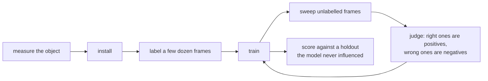

# A worked example: one object class on a fixed camera

A setup you can follow by hand or hand to an agent: one kind of object, one fixed camera or screen
capture, the `heatmap` backend. Every command has been run and every function named exists at the
version this ships with. Where a limit applies it is stated, not glossed.



## 0. Decide whether it fits

The `heatmap` backend assumes the object is a **fixed, known size** on screen. It predicts *where*
something is and which class it is, and regresses no width or height. That assumption is why it is
about 100,000 parameters instead of millions, and it is a real limit.

| your setup | fits? |
|---|---|
| Fixed camera, objects pass at roughly one distance | Yes. The good case. |
| Top-down camera at a fixed height | Yes. |
| A screen capture where the object is drawn at one size | Yes. |
| Objects at different distances, or classes of very different sizes | Use the `box` backend. It predicts each object's own box; its measured weak spot is objects overlapping. |
| A moving or handheld camera | Not tested. Both backends were built for a fixed one. |
| You need outlines, not positions | No. You want segmentation. |
| Several classes, one channel each | Yes, with a caveat - see section 6. |

**Quick self-test.** Take twenty frames and measure the object in pixels in each. If the largest is
more than roughly 1.5x the smallest, the fixed-size assumption is broken: use `box`.

## 1. Install

```bash
uv add "smolsmort[vision] @ git+https://github.com/BalthazarFitzpatrick/smolsmort.git@v0.4.1"
uv run python -c "from smolsmort.detect import model, train, dataset, scoring; print('ok')"
```

`[vision]` pulls torch (about 2 GB). Without it you get the loop, the box maths, scoring and
tracking but no model.

## 2. What you supply

Two routes to labelled frames; pick by how much you already have.

**The review tool** (`uv run smolsmort`) is the intended one: bind a folder of frames, draw boxes,
sort the tiles, promote a set, train, sweep, judge the proposals. The [user guide](GUIDE.md) walks
each tab. Everything below then happens through the tabs and you can skip to section 7.

**The library**, if you have coordinates from elsewhere - any tool that exports box centres, or a
classical detector (background subtraction, a blob or template matcher) that gets you most of the
way and you correct the rest. That corrected classical detector is what the first consumer started
from; the code calls it the *teacher*.

Either way, measure **one number** up front: the typical object size in pixels, width and height.
Every step uses it.

```bash
# open five frames and note a typical object's bounding box
OBJ_W=120
OBJ_H=48
```

## 3. Build the training examples

An `Example` is one frame plus everything known about it.

```python
from pathlib import Path

from smolsmort.detect.dataset import Example

examples = [
    Example(
        path=Path("frames/0001.jpg"),
        centres=[(412.0, 233.0), (690.0, 251.0)],  # object centres, in FRAME pixels
        labels=[None, None],  # or ["kind_a", "kind_b"], see section 6
        negatives=[(120.0, 400.0)],  # places you KNOW hold no object
        ignore=[],  # regions to leave out of the loss entirely
    ),
]
```

Three fields carry more weight than they look:

- **`centres`** - the centre of the object, not a corner, in the frame's own pixels.
- **`negatives`** - somewhere you have confirmed there is nothing. Worth more per example than a
  positive: it teaches the model *its own* mistakes rather than ones you guessed at. Feed it every
  false positive the model produces.
- **`ignore`** - regions you have not labelled. Frames are usually only partly labelled; an
  unmarked object in a corner teaches the model that objects are background unless the region is
  ignored. This field is how you stay honest about incompleteness.

**How many frames?** Enough that thin cases appear at all. Fifty labelled frames is a real start;
the loop is how it grows.

## 4. Train

```python
from pathlib import Path

from smolsmort.detect.train import minimum_window, save, train

print(minimum_window(OBJ_W, OBJ_H))  # the smallest window that never clips the object

model, history = train(
    examples,
    epochs=30,
    crop=256,  # training window, in INPUT px; at or above the floor printed above
    on_progress=lambda p: print(p),
)
save(model, Path("weights/objects-v1.pt"))
```

The window must be large enough that the object still fits after the training jitter offsets it,
or you teach the net half an object as a whole one. The net runs on the frame at `downscale` (2 by
default), so a 120 px object is 60 px to the model - many cells across at stride 4. If your objects
are much smaller than about 20 px in the frame, lower the downscale or move the camera closer.

The model records the frame width it was trained at. A frame of another width is resampled to it
at inference, and the boxes come back in the frame's own pixels.

## 5. Predict, then feed the mistakes back

```python
from pathlib import Path

from smolsmort.detect.train import load, sweep

model = load(Path("weights/objects-v1.pt"))
candidates = sweep(
    model,
    {"object": 0},
    sorted(Path("unlabelled/").glob("*.jpg")),
    width=OBJ_W,
    height=OBJ_H,
    min_score=0.30,  # deliberately low, see below
    max_per_frame=12,
)
```

Each candidate is a dict with `path`, `left`, `top`, `width`, `height`, `score`. Pixels you
already hold need no file: `predict_frame(model, frame, classes=..., width=..., height=...)` walks
the same steps.

**Set `min_score` low and filter afterwards, not the reverse.** A floor above what the model
actually produces returns zero boxes and reports success; that happened three times in the first
consumer. Look at the score distribution first, then choose. The train tab's separation readout
exists for exactly this.

**This is the loop, and it is the whole point:**

1. Sweep frames nobody has labelled.
2. Look at what came back. Right ones are new positives. Wrong ones are new **negatives**.
3. Retrain with the corrections included.
4. Repeat.

A wrong prediction is worth more than a right one: it is a labelled example of the exact confusion
this model makes, which you could not have guessed.

## 6. Classes: one channel each

```python
model, history = train(examples, classes={"kind_a": 0, "kind_b": 1, "kind_c": 2}, epochs=30)
```

Channels train **independently**: an object of one class is not a negative for another, it simply
leaves that channel empty where it stands. Adding a class is cheap and a rare class is not drowned
out by a common one, which one softmax over the same labels would do.

**Do not add a channel before you have examples of it.** A class with three examples produces a
channel that fires on noise, and it will look like the model working.

## 7. Measure it against a holdout, and be suspicious of good news

```python
from smolsmort.detect.scoring import score

result = score(predictions, truths)  # both: one list of Box per frame, same order
print("\n".join(result.lines()))
```

Three warnings, each learned the hard way:

**Hold frames back that the model has never influenced.** If your labels came from correcting an
earlier model's output, scoring against them measures agreement with that model, not correctness.
The first consumer's detector reported a healthy internal score and scored **24% precision** on
genuinely unseen hand-drawn frames, with the highest-scoring detections the wrong ones.

**A separation or confidence score is not accuracy.** Read it as "did training converge", never as
"is it right".

**Check the holdout is the same resolution and scale.** Frames from a different capture measure the
mismatch, not the model. Since v0.3.0 a frame of another width is resampled to the model's; a
holdout at another *scale* (the object a different size on screen) still is not comparable.

## 8. Tracking, if the object moves between frames

```python
from smolsmort.detect.track import track

positions = track(per_frame, ordered_paths)  # {frame path: (x, y)}
```

`per_frame` maps a frame path to its candidate list. **`ordered_paths` must be in recording
order** - each frame is read against the previous one, so shuffling silently turns tracking back
into independent peak-picking.

It handles the three failure modes that matter: no history (takes the strongest), a decoy nearby
(takes the strongest among the *plausible*, not the nearest), and a smooth-but-wrong run after a
bad re-acquire (a median over a neighbourhood, the only thing that catches it).

## Checklist for an agent

```
[ ] measured typical object size in px (W, H); confirmed largest/smallest < 1.5x
[ ] installed smolsmort[vision]; import check passes
[ ] >= 50 frames with centres; unlabelled regions in `ignore`
[ ] crop >= minimum_window(W, H)
[ ] trained, weights saved
[ ] swept unlabelled frames with a LOW min_score; looked at the distribution
[ ] false positives added as `negatives`; retrained
[ ] scored against a holdout the model never influenced
[ ] holdout is the same camera and scale as training
```

## Where this goes wrong quietly

- **A partly-labelled frame with no `ignore`** teaches the model that objects are background.
- **A `min_score` above the model's output range** returns nothing and looks like success.
- **A holdout derived from model output** reports agreement, not accuracy.
- **Objects at varying distance on the heatmap backend** break its fixed-size assumption; the
  failure looks like a model that never quite converges, not like a wrong choice of tool. Use `box`.
